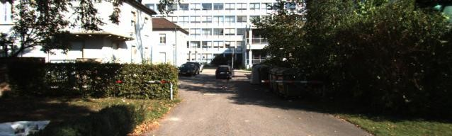
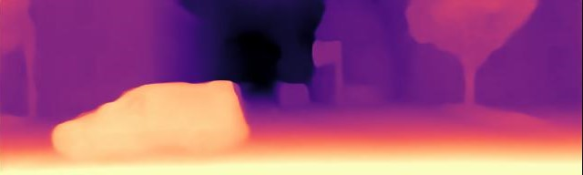

Source code - Python Tensorflow Implementation 

# i3D-iMAGE-FORMER : Metric Scale Depth Prediction 
 DCViT-Dual Convolution Vision Transformer for Single Image Depth Prediction
 Note: The open-source Python implementation of DCViT will be released soon.
 
 ### RGB input and depth prediction samples
 

 

  
   

   

   

 

### Application example: Metric scale monocular SLAM

[Watch on YouTube](https://www.youtube.com/watch?v=EfvvFmAQTpE)
